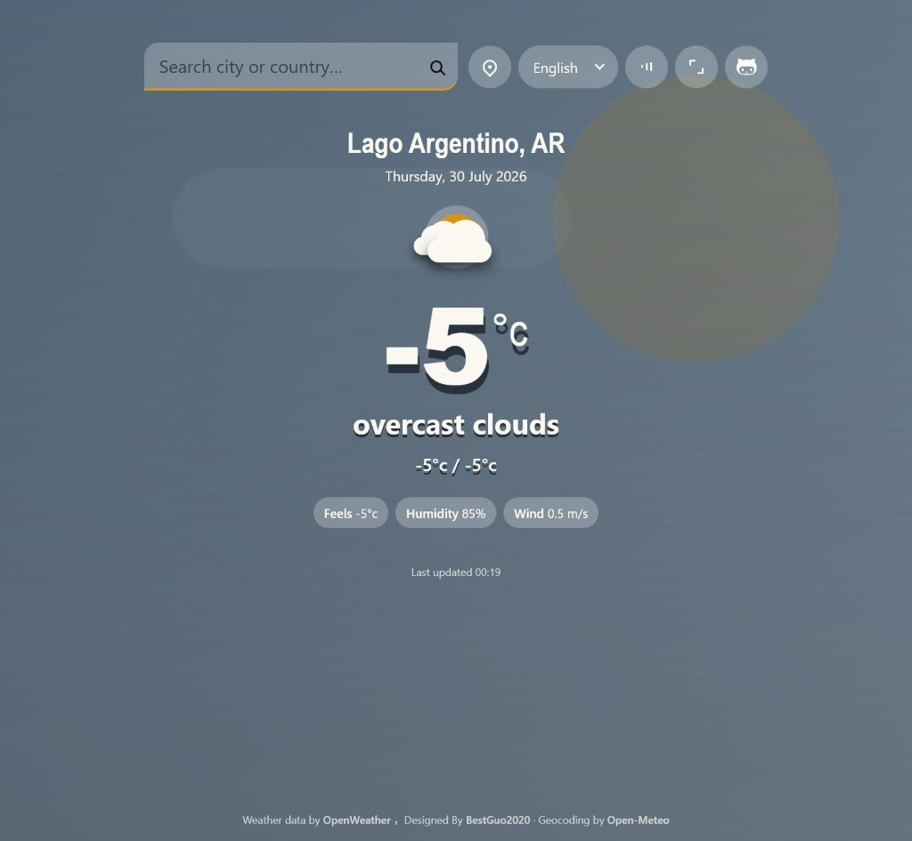
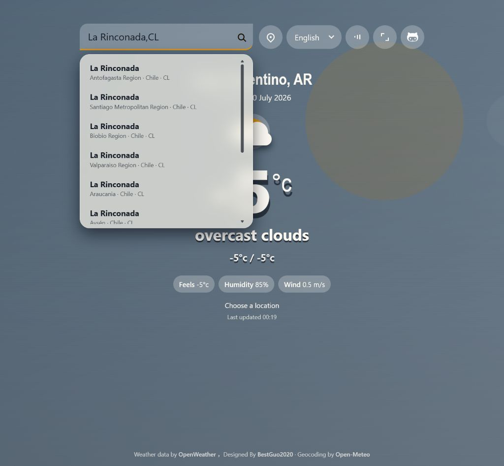

# My Weather

[简体中文](./README.zh-CN.md)

A lightweight, responsive weather page with animated weather scenes, multilingual UI, location-aware search, and ambiguity handling for places that share the same name.



## Features

- Current temperature, weather condition, feels-like temperature, humidity, wind speed, and daily low/high
- Animated scenes for clear skies, clouds, rain, snow, thunderstorms, and mist
- Rain and snow are confined to the miniature city, with three depth layers and intensity tiers; rain adds umbrellas, reflections and ripples, while snow covers roofs, trees and street edges
- Day and night presentation based on the selected location
- Cloud cover controls distinct clear, fair, cloudy and overcast skies, with rain/snow/storm cloud forms; daylight stays bright and night palettes remain independent
- Layered streets adapt building heights, spacing and trees to the nearby LCZ class, alongside weather effects. Global LCZ Map v3 uses ~100 m resolution and a nominal 2018 reference year; missing data falls back to a generic street ([classification and data notes](./docs/city-scene.md)).
- Search powered by OpenWeather and Open-Meteo geocoding
- Disambiguation menu for places with identical names
- Relevance filtering that prioritizes exact place-name matches over fuzzy matches
- Browser geolocation with IP-based fallback
- Chinese, English, Spanish, French, and Japanese interfaces
- Synthesized weather ambience using the Web Audio API
- Fullscreen mode, responsive layout, and reduced-motion support
- Automatic weather refresh every 12 minutes

## Location Search

Enter a city or place name in the search field and press <kbd>Enter</kbd> or select the search button.

For more precise results, append a two-letter ISO country code:

```text
La Rinconada,CL
Northampton,GB
Longhua,CN
```

When several places match, the page displays their administrative region, country, and country code. Select the intended location before weather data is loaded.



OpenWeather returns at most five geocoding results, so the app supplements its results with Open-Meteo and removes duplicate or weakly related candidates. Weather conditions are fetched by the selected coordinates.

Searching for Longhua District retains the districts in both Shenzhen and Haikou as separate choices. Chinese queries such as `龙华区天气` are also supported. The page and browser title retain the selected place's name through refreshes and language changes, even when the weather API labels those coordinates with a nearby subdistrict. Unmatched searches display a place-not-found message.

## Controls

| Control | Purpose |
| --- | --- |
| Search | Search for a city, district, or named place |
| Location | Use browser geolocation; falls back to an approximate IP location when needed |
| Language | Switch between Chinese, English, Spanish, French, and Japanese |
| Sound | Toggle synthesized weather ambience |
| Fullscreen | Enter or leave fullscreen mode |
| GitHub | Open the project repository |

Location and fullscreen features depend on browser support and permissions. IP-based positioning is approximate and may resolve to a nearby city.

On EdgeOne Pages, the site first requests the same-origin `/api/ip-location` edge function, which queries HiOFD using EdgeOne's client-IP metadata and disables location-response caching. If the proxy is unavailable, the existing IP providers remain available. A successful browser location still takes priority.

`edgeone.json` configures `npm run build` and the `dist` output directory for Git-connected deployment. Commit the root `edge-functions` and `lib` directories together with the site. See the [API and deployment notes](./docs/hiofd-ip-query.md).

## Getting Started

### Requirements

My Weather builds TypeScript into static HTML, CSS, and JavaScript. LCZ data is read on demand through a same-origin edge function.

- Local builds and previews require Node.js 20.11 or newer and npm.
- Deploy the built `dist/` alongside the root `edge-functions/` and `lib/` directories, supported by EdgeOne Pages.
- Static-only hosting can show weather and the generic street; actual LCZ backgrounds require `/api/lcz-raster`.
- Visitors only need a modern browser.

### Build an optimized version

```bash
npm install
npm run build
```

This step bundles and minifies the source files. The optimized site is generated in `dist/`.

`src/` contains TypeScript source. Use the built `dist/` for deployment.

### Preview locally

```bash
npm run preview
```

Then open:

```text
http://127.0.0.1:4173/
```

Build first, then preview. The server disables page caching and runs the LCZ raster proxy, enabling real local-form checks. Existing IP fallback remains available when device location fails.

## OpenWeather API Key

The weather and OpenWeather geocoding requests use the `API_KEY` constant in `src/script.ts`.

To use your own key:

1. Create an account at [OpenWeather](https://openweathermap.org/).
2. Generate an API key.
3. Replace the `API_KEY` value in `src/script.ts`.
4. Rebuild the project with `npm run build`.

## Project Structure

```text
.
├── docs/
│   └── images/             # README screenshots
├── raw/                    # Original/reference implementation
├── src/
│   ├── index.html          # Page structure
│   ├── script.ts           # Weather, geocoding, UI, audio, and effects
│   ├── city-profile.ts     # LCZ types and visual tiers
│   ├── city-scene.ts       # Street generation
│   ├── lcz-data.ts         # Windowed raster reads
│   ├── style.css           # Layout, weather scenes, and responsive styles
│   └── tokens.css          # Design tokens
├── edge-functions/         # Same-origin location and LCZ proxies
├── tools/preview.mjs       # Local page and API preview
├── build.ts                # Production build pipeline
├── package.json
├── README.md
└── README.zh-CN.md
```

The build pipeline uses:

- [esbuild](https://esbuild.github.io/) for JavaScript
- [Lightning CSS](https://lightningcss.dev/) for CSS
- [html-minifier-terser](https://github.com/terser/html-minifier-terser) for HTML

## Data Sources and Credits

- Weather data: [OpenWeather](https://openweathermap.org/)
- Geocoding: [OpenWeather](https://openweathermap.org/) and [Open-Meteo](https://open-meteo.com/)
- Design and development: [BestGuo2020](https://www.bestguo.top)

Open-Meteo geocoding data is based on GeoNames. Review each provider's attribution, rate-limit, and licensing requirements before deploying the project commercially.

## License

This project is released under the [MIT License](./LICENSE).

You may use, copy, modify, merge, publish, distribute, sublicense, and sell copies of the software, provided that the original copyright notice and license notice are retained.
