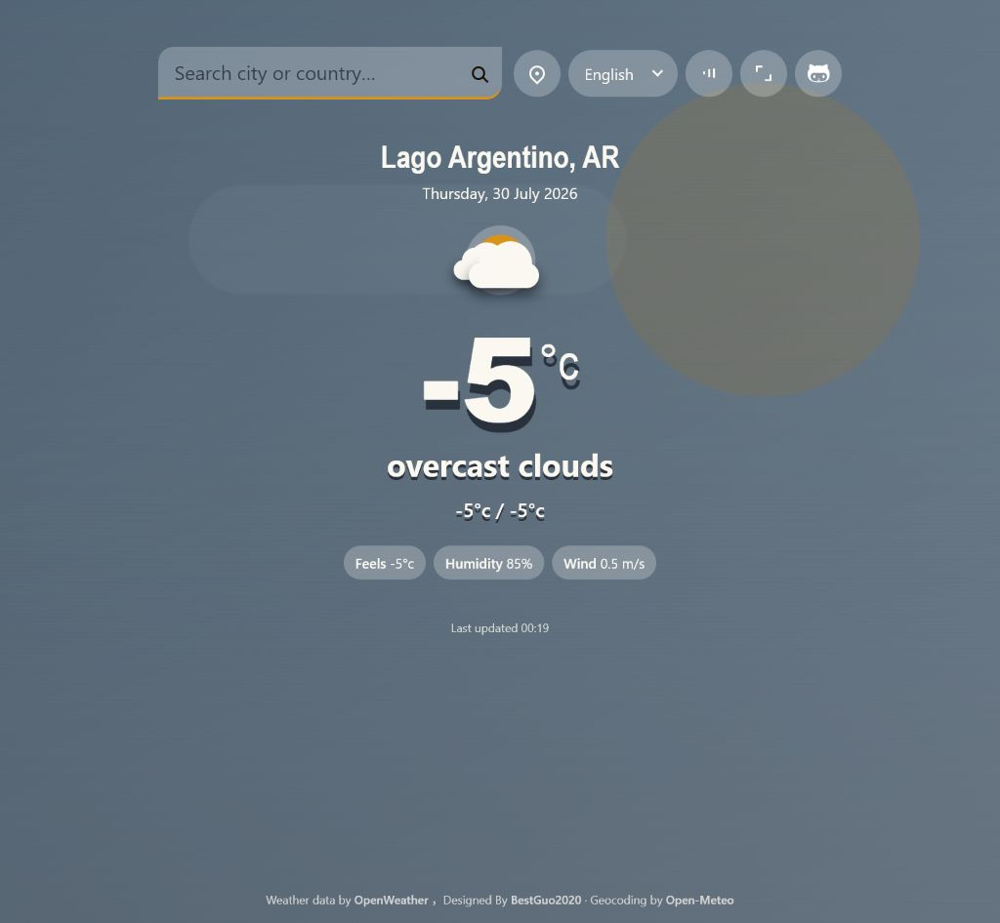
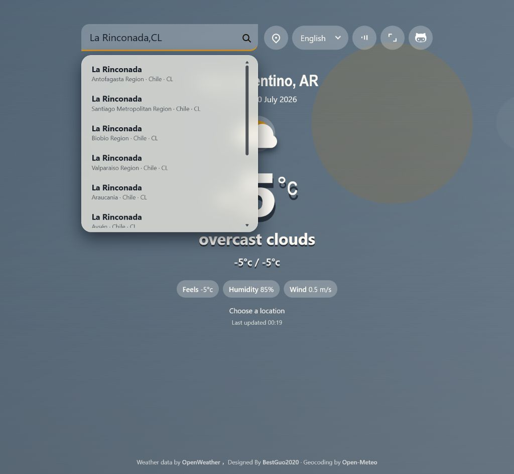

# My Weather

[English](./README.md)

一个轻量、响应式的天气网页，提供动态天气场景、多语言界面、位置搜索以及同名地点消歧功能。



## 主要功能

- 显示当前温度、天气状况、体感温度、湿度、风速和当日最低/最高温
- 支持晴天、多云、雨、雪、雷暴和雾霾等动态天气场景
- 雪天具有远、中、近三层旋转雪花，并根据小雪、中雪和大雪调整密度
- 根据地点时间切换白天与夜间效果
- 使用 OpenWeather 与 Open-Meteo 进行地点搜索
- 对同名城市和地点显示候选列表
- 优先保留完全匹配的地点，过滤低相关度模糊结果
- 支持浏览器定位，并在必要时使用 IP 地址进行近似定位
- 支持中文、英文、西班牙语、法语和日语
- 使用 Web Audio API 合成天气环境音
- 支持全屏、响应式布局和减少动态效果设置
- 每 12 分钟自动刷新天气数据

## 地点搜索

在搜索框中输入城市或地点名称，然后按 <kbd>Enter</kbd> 或点击搜索按钮。

为了获得更准确的结果，可以在名称后附加两个字母的 ISO 国家代码：

```text
La Rinconada,CL
Northampton,GB
龙华,CN
```

遇到同名地点时，网页会显示行政区、国家名称和国家代码。选择正确地点后，网页才会根据该地点的经纬度获取天气。



OpenWeather 的地理编码接口最多返回 5 条结果，因此本项目会使用 Open-Meteo 补充候选，并对重复项和低相关度结果进行过滤。最终天气数据按照用户选择的坐标获取。

## 页面控制

| 控件 | 用途 |
| --- | --- |
| 搜索 | 搜索城市、区县或其他命名地点 |
| 定位 | 使用浏览器定位；必要时回退到 IP 近似定位 |
| 语言 | 在中文、英文、西班牙语、法语和日语之间切换 |
| 声音 | 开启或关闭合成天气环境音 |
| 全屏 | 进入或退出全屏模式 |
| GitHub | 打开项目仓库 |

定位和全屏功能依赖浏览器支持与用户授权。IP 定位只能提供近似位置，有可能显示附近的城市。

## 本地运行

### 环境要求

My Weather 是由 HTML、CSS 和 JavaScript 构成的纯静态网页，**运行和部署本项目并不依赖 Node.js**。

- 没有 Node.js 环境时，可以直接将 `src/` 目录中的内容部署到任意静态 Web 服务器。
- 只有在需要生成经过打包、压缩的 `dist/` 生产文件时，才需要安装 Node.js 18 或更高版本及 npm。
- 网页访问者只需要使用现代浏览器。

### 构建优化版本

```bash
npm install
npm run build
```

该步骤会对源代码进行打包和压缩，优化后的文件会生成在 `dist/` 目录。

如果没有 Node.js 环境，可以跳过此步骤，直接将 `src/` 作为网站根目录使用。

### 本地预览

```bash
npm run preview
```

然后访问：

```text
http://127.0.0.1:4173/
```

预览命令会运行生产构建，并关闭浏览器缓存。未经构建的源码，同样也可以使用任意静态 Web 服务器直接托管 `src/`。

## OpenWeather API Key

天气和 OpenWeather 地理编码请求使用 `src/script.js` 中的 `API_KEY`。

如需使用自己的 Key：

1. 在 [OpenWeather](https://openweathermap.org/) 注册账号。
2. 创建 API Key。
3. 替换 `src/script.js` 中的 `API_KEY`。
4. 执行 `npm run build` 重新构建。

## 项目结构

```text
.
├── docs/
│   └── images/             # README 截图
├── raw/                    # 原始/参考实现
├── src/
│   ├── index.html          # 页面结构
│   ├── script.js           # 天气、地理编码、交互、音频和动效
│   ├── style.css           # 布局、天气场景和响应式样式
│   └── tokens.css          # 设计变量
├── build.mjs               # 生产构建流程
├── package.json
├── README.md
└── README.zh-CN.md
```

构建工具：

- [esbuild](https://esbuild.github.io/)：JavaScript 构建与压缩
- [Lightning CSS](https://lightningcss.dev/)：CSS 打包与压缩
- [html-minifier-terser](https://github.com/terser/html-minifier-terser)：HTML 压缩

## 数据来源与致谢

- 天气数据：[OpenWeather](https://openweathermap.org/)
- 地理编码：[OpenWeather](https://openweathermap.org/) 与 [Open-Meteo](https://open-meteo.com/)
- 设计与开发：[BestGuo2020](https://www.bestguo.top)

Open-Meteo 的地理编码数据基于 GeoNames。商业部署前，请确认各数据提供方的署名、调用限制和许可要求。

## 许可证

本项目采用 [MIT License](./LICENSE) 开源。

在保留原始版权声明和许可证声明的前提下，你可以自由使用、复制、修改、合并、发布、分发、再许可及销售本软件的副本。
